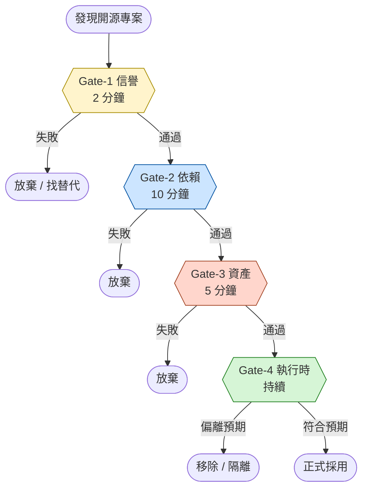

# 開源專案安全檢查流程

## 第一節：流程的必要性

「`pip install <package>` 就能用」這句話，在開源生態的早期是一句鼓勵；在今日則是一個被刻意保留的方便假象。實際上，自 `pip install` 至套件實際在使用者環境中執行的這一段路徑上，至少存在四類風險：

1. **作者風險**：套件作者帳號被駭、惡意接管、棄置維護。
2. **依賴風險**：套件本身合法，其上游依賴被植入惡意。
3. **資產風險**：套件下載的權重、模型、資料被替換或竄改。
4. **執行時風險**：套件運行時的網路行為、遙測、資料外送，超出使用者預期。

本流程將上述四類風險對應為四道關卡（Gate）。每道關卡只在前一關通過後執行，任一關失敗即終止引入。本流程的設計目標並非「絕對安全」（此目標不可達），而是**將風險決策外顯化**：每一個被接受的風險，都應被使用者明示同意。

## 第二節：流程概覽



四道關卡的累積時間成本：**首次引入約 30 分鐘**。對於後續安裝同一作者的其他套件，可重用 Gate-1 結論，僅需重跑 Gate-2~4。

---

## 第三節：Gate-1 信譽（Reputation）

### 要回答的問題

「這個套件的作者與社群，是不是值得我把執行權交給他們？」

### 檢查項目

| 項目 | 觀察方法 | 通過條件（建議） |
|------|---------|----------------|
| Stars 數 | GitHub 頁面 | > 1,000 或有知名組織背書 |
| 最後更新 | commit 歷史 | 近 6 個月有 commit |
| Contributors | 頁面側欄 | > 5 人，或單一商業實體公開維護 |
| Open Issues 與回覆頻率 | Issues 頁面 | 安全相關 issue 有人處理 |
| License | `LICENSE` 檔 | 授權條款明確且使用者可接受 |
| 組織背書 | 帳號類型（個人 / 組織 / 公司） | 商業公司、基金會、知名研究機構優於匿名個人 |
| README 品質 | 首頁 | 完整、無拼字錯誤、有文件站 |

### 紅旗

- License 缺失：法律風險未知。
- 單一作者 + 新帳號 + 高 stars 短時間爆衝：可能為社群工程攻擊前置。
- README 充滿拼字錯誤、連結失效：維護品質可疑。
- AGPL-3.0 / SSPL：技術上合法，但若使用者有商用 / SaaS 計畫，視為條件通過，於最終決策階段重新評估。

### 通過條件

技術面紅旗為零，且授權條款可接受（或於後續關卡明確處理）。

---

## 第四節：Gate-2 依賴（Dependency）

### 要回答的問題

「在我執行任何一行此套件的程式碼之前，套件的安裝過程本身會不會出問題？」

### 檢查項目

#### 4.1 依賴清單

讀取 `pyproject.toml`、`requirements.txt`、`package.json` 等清單，逐項檢查：

- 是否有不認識的套件名稱？
- 名稱是否與知名套件僅差一個字母（typosquatting）？
- 來源 registry 是否為官方（PyPI / npm 預設），而非私有 mirror？

#### 4.2 安裝腳本（postinstall / build hooks）

- Python：`pyproject.toml` 中是否有 `build-backend` 自定義？是否有 setuptools 自訂指令？
- Node.js：`package.json` 中是否有 `postinstall`、`preinstall` 腳本？

惡意套件常於此階段執行任意指令（下載第二階段 payload、寫入 `~/.bashrc` 等）。**任何下載 / 執行外部腳本的安裝動作均視為紅旗**。

#### 4.3 對外連線盤點

於套件原始碼中搜尋：

```bash
grep -r "http://\|https://\|fetch\|axios\|requests\.\|urllib" src/
```

針對每一個硬寫的 URL，回答：用途為何？觸發時機？可否關閉？

#### 4.4 已知漏洞掃描

```bash
# Python
pip-audit                # 推薦，PyPI 官方背書
# 或
safety check

# Node.js
npm audit
```

### 紅旗

- 安裝過程下載任何外部資源並執行。
- 依賴中含已停止維護的套件（last-update > 2 年）。
- 高 / Critical CVE 未有 patch 或繞過方案。
- 大量硬寫對外 URL 且文件未說明用途。

### 通過條件

依賴清單合理、無 postinstall、CVE 掃描乾淨、對外連線可被解釋且可關閉。

---

## 第五節：Gate-3 資產來源（Assets）

### 要回答的問題

「此套件運行時下載的資料（模型權重、字典、設定檔、預訓練語料），是否來自可驗證的來源？」

此關卡對 AI / ML 套件特別重要，因為模型權重往往以二進位形式從 CDN 下載，使用者無法直接審閱。

### 檢查項目

| 項目 | 觀察方法 | 通過條件 |
|------|---------|---------|
| 託管位置 | 程式碼中的下載 URL | 官方 GitHub Releases、官方 CDN，非第三方鏡像 |
| 發布者 | release 頁面的 publisher | 與套件作者一致 |
| 完整性憑證 | release metadata 或下載頁 | 提供 SHA256 / SHA512 checksum |
| 簽章 | GPG / Sigstore | （加分項，非必要） |

### 實務動作

```bash
# 下載後計算 hash
# Linux / macOS
sha256sum model.bin

# Windows PowerShell
Get-FileHash -Algorithm SHA256 model.bin
```

對比結果與 release 頁面公布的 hash。若無公布，採 **trust-on-first-use**：將首次下載的 hash 釘入專案文件，此後任何不一致均視為警告。

### 紅旗

- 從不明 URL 直連下載，無 release metadata。
- 模型 hash 隨時間改變且無 release note 說明。
- 套件強制使用第三方鏡像而非主來源。

### 通過條件

至少一種憑證機制（官方 hash 或 trust-on-first-use）建立完成。

---

## 第六節：Gate-4 執行時監控（Runtime）

### 要回答的問題

「此套件在我的環境中實際運行時的行為，是否與前三關的觀察一致？」

### 檢查項目

#### 6.1 隔離環境

於專屬 venv（Python） / 隔離容器（Docker）中執行。**禁止系統 Python 直接安裝**。

#### 6.2 遙測關閉

針對 Gate-2 中盤點到的對外連線，逐項關閉：

- 套件 CLI 設定（如 `<tool> settings sync=False`）
- 環境變數（如 `DO_NOT_TRACK=1`、`<TOOL>_TELEMETRY=0`）
- 不安裝 optional dependency（如不安裝 `sentry-sdk`）

#### 6.3 對外連線觀察

```bash
# Linux：lsof 觀察
lsof -p <python_pid> -i

# Windows：Get-NetTCPConnection
Get-NetTCPConnection -OwningProcess <pid>

# 或最保險：第一次運行時斷網
```

#### 6.4 行為一致性

- 推論結果是否符合預期（範例輸入是否得到合理輸出）？
- 是否在無關時機觸發網路請求？
- 是否寫入 cwd / home 目錄之外的位置？

### 紅旗

- 於斷網狀態下無法運行（即使是「離線」工具）。
- 觀察到對未盤點 URL 的連線。
- 寫入未預期的系統位置（registry、startup folder、cron）。

### 通過條件

實際行為與 Gate-2 的程式碼觀察一致，無未解釋的偏離。

---

## 第七節：流程使用建議

1. **不要嘗試一次學會全部**：四關卡的精神比細節重要。第一次完整跑過一個套件是必要的（建議從本 repo 的 [案例.md](案例.md) 開始），之後對熟悉的套件可以「快速掃描」。
2. **記錄你的判斷**：每個被接受的風險都應有書面記錄（即使只是一行 commit message）。日後若上游條件改變，這些記錄是修正決策的依據。
3. **流程不替代信任**：四關卡通過不代表此套件絕對安全，僅代表使用者已明示同意已知風險。對於用於生產環境的套件，建議補充：定期重跑 Gate-2 與 Gate-3、訂閱上游 security advisory。
4. **將流程套用到非套件的開源資產**：模型 hub（HuggingFace）、設定檔範本（dotfiles）、Docker 映像，皆可套用本流程的精神，僅需調整每關的具體檢查項。

---

## 附錄 A：本流程的精簡版（緊急情境用）

當情境不允許 30 分鐘的完整檢查時，最低限度應執行：

1. 確認 GitHub stars > 1,000 且帳號為已知組織。
2. 於 venv 中安裝後立即跑 `pip-audit`。
3. 第一次執行時開 firewall log（或斷網），觀察對外連線。

三步均通過，可暫時接受該套件，並排程於三日內補完整流程。
